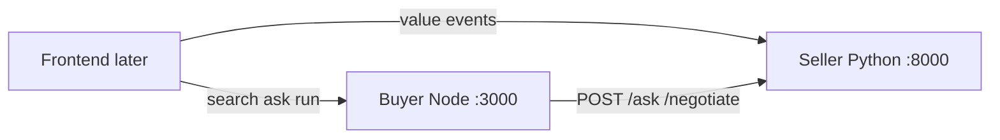

# Ampy backend

One backend for Ampy’s **buyer** and **seller** agents. Both share the repo-root
`.env` and start together with a single command. The product frontend is separate.

```
backend/
  start.mjs          # npm start entrypoint
  seller/            # Python FastAPI — valuation, negotiate, events, /ask + /negotiate
  buyer/             # Node Express — marketplace search + buyer agent API
```



## Setup

Python 3.11+, [uv](https://docs.astral.sh/uv/), and Node 18+ are required.

```bash
# Shared Mistral config (same names for both agents)
cp .env.example .env
# edit .env — set MISTRAL_API_KEY

# Seller deps
cd backend/seller && uv sync && cd ../..

# Buyer deps
npm run install:buyer
```

`.env` variables:

```
MISTRAL_API_KEY=
MISTRAL_MODEL=mistral-medium-latest
MISTRAL_SEARCH_TOOL=web_search
```

## Start both

From the repo root:

```bash
npm start
```

That runs [`backend/start.mjs`](backend/start.mjs), which:

1. Starts the seller on `http://127.0.0.1:8000`
2. Waits for `GET /health`
3. Starts the buyer on `http://127.0.0.1:3000` with `SELLER_AGENT_URL` pointing at the seller

Ctrl+C stops both.

### Ports

| Service | URL | Role |
|---|---|---|
| Buyer API | `http://127.0.0.1:3000` | Search, agent run, ask, negotiate |
| Seller API | `http://127.0.0.1:8000` | `/ask`, `/negotiate`, `/seller/value`, `/events/discover` |

### Start separately (optional)

```bash
npm run start:seller   # terminal 1
npm run start:buyer    # terminal 2
```

## Buyer ↔ seller contract

The Node buyer talks to the Python seller over plain HTTP:

- `POST http://127.0.0.1:8000/ask` → `{ "answer": "..." }`
- `POST http://127.0.0.1:8000/negotiate` → `{ "message", "counterPrice", "accepted", "walkAway" }`

Existing seller routes remain for valuation and event discovery:

- `POST /seller/value`
- `POST /seller/negotiate`
- `POST /events/discover`

Verify the wire contract:

```bash
node backend/buyer/tools/checkSellerAgent.js http://127.0.0.1:8000
```

See [`backend/buyer/INTEGRATION.md`](backend/buyer/INTEGRATION.md) for request/response shapes.

## What each agent does

**Seller** — researches resale value with guarded negotiation floors, answers
buyer questions, and discovers local sourcing events.

**Buyer** — searches Craigslist / optional Facebook / Ampy listings, questions
sellers, and negotiates under a hard budget.

Reseller and calendar-context upsell are not in this backend yet.
